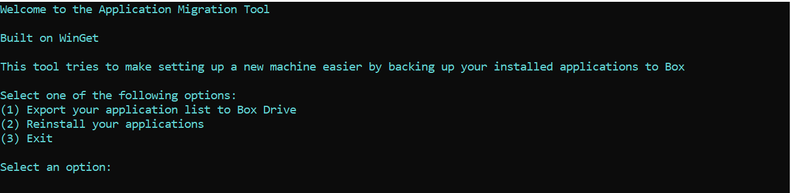
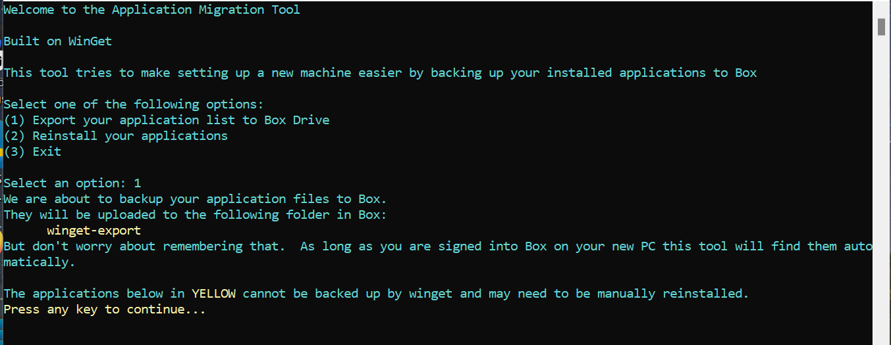
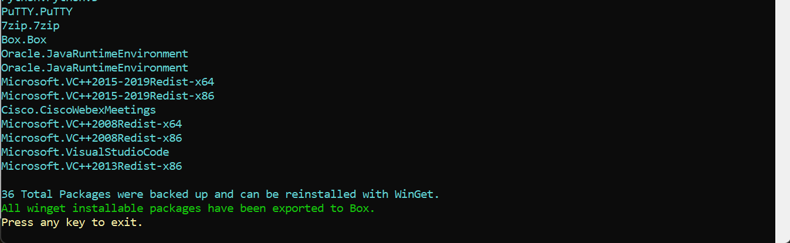
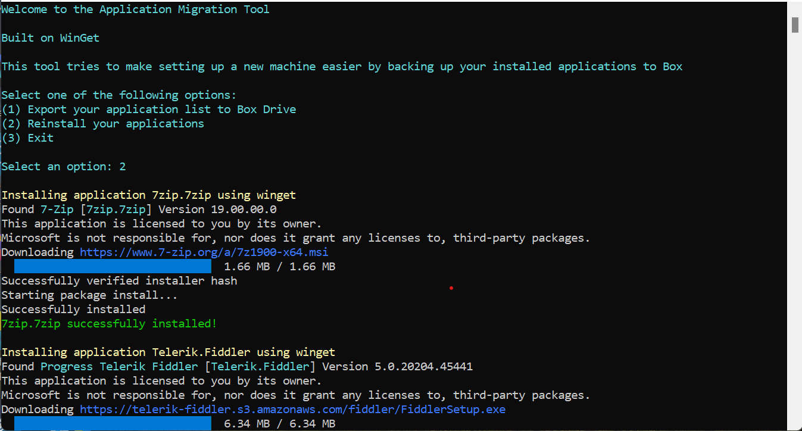

# Windows Application Migration Tool
 
## Overview
 
 This little tool uses [Winget](https://devblogs.microsoft.com/commandline/windows-package-manager-1-1/) to back up and restore applications installed on your Windows System to Box.  It is meant to make migrating to a new machine (or rebuilding an existing one) easier.  This is useful if your company uses Box for file storage; if you don't, use this code as a template for your own cloud file storage solution.

## Exporting your applications

Using the tool is super simple; follow the menu to do what you want to do.  It will install Winget for you and export a list of your applications to [Box](https://box.com)!  Mind you, it will only be able to back up and restore those applications supported by Winget; not all applications will be covered by this tool.  Regardless, it should make migrating easier though, right?

## Restoring your applications

Restoring your applications is super easy!  Just select option 2, and it will install Box for you, wait for you to sign in (don't forget to do that!) and then install the applications you backed up!  Keep in mind, it only reinstalls the actual applications; it does not back up your application data or settings.  Yet.

